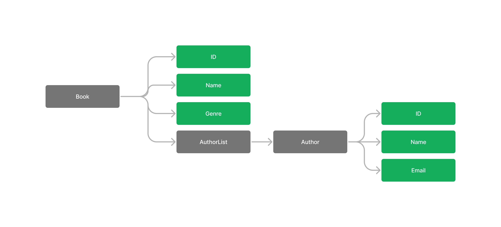

# book-server-backend

## Run server
first export the mongodb cluster uri
```bash
export MONGODB_URI="mongodb+srv://<username>:<password>@<mongo_cluster>/?retryWrites=true&w=majority"
go run main.go
```

## Run container
### User
```bash
docker pull superm4n/book-server-backend:v0.0.0
docker run -d -p 8080:8080 superm4n/book-server-backend:v0.0.0
```

### Developer
* `make build`, to build the container.
* `make run`, to run the container.
* `make push`, to push the container in remote repository.

## APIs
* `[GET]`:`/ping` - Used to check the connectivity.
* `[POST]`:`/apis/v1/author` - Adds an author to the database. The request body contains 
    ```json
    {
        "name": "<author_name>",
        "email": "<author_email>"
    }
    ```
* `[GET]`:`apis/v1/author/{name}` - Gets the author's information. The author is identifies by the `name`.
* `[DELETE]`:`apis/v1/author/{name}` - Deletes the author whose name is identified in `name`.
* `[POST]`:`apis/v1/book` - Adds a book the database. The body contains
    ```json
    {
        "name": "fire and blood",
        "genere": "fiction",
        "authors": ["mr. X","mr. y"]
    }
    ```
* `[GET]`:`apis/v1/book/{name}` - Gets a book specified by the name
* `[DELETE]`:`apis/v1/book/{name}` - Removes a book from the database specified by the `name`.

## Architecture
